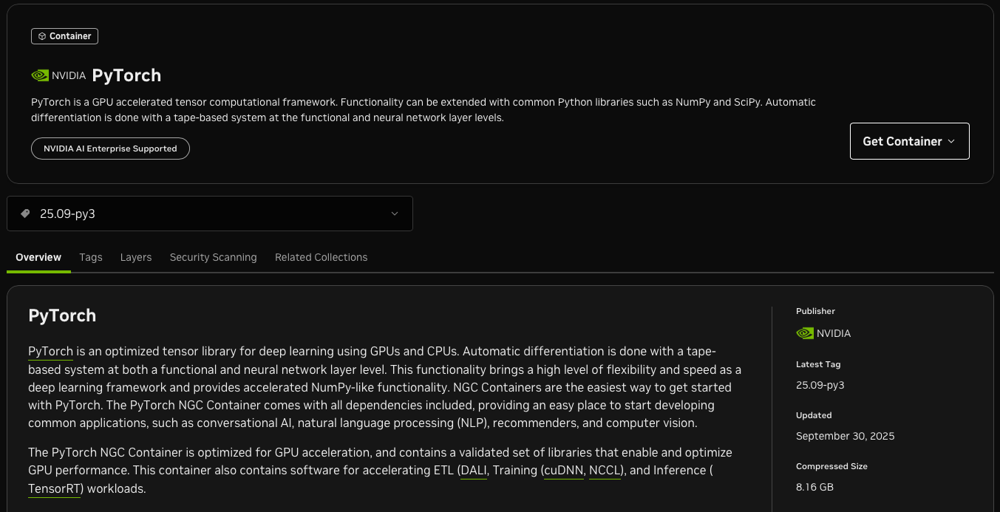

# How to Setup an Apptainer Container in Spartan (HPC)

##  First of all, test the container on a PC with GPU 

### 1) Docker installation - Follow the steps as mentioned below

1. Install the docker engine in an ubuntu desktop – Follow the guideline as in https://docs.docker.com/engine/install/ubuntu/

    Here you have several options to install docker. Before that uninstall old docker versions if available. Then follow the installation process under ```Install using the apt repository```. 

2. Then verify if the Nvidia drivers are available – `nvidia-smi` or `nvcc --version`. If the drivers are available `nvidia-smi` always works, but `nvcc --version` works if and only if cuda tool kit is installed in the PC. So don’t worry if `nvcc -version` didn’t work. 

3. Install Cuda container toolkit- https://docs.nvidia.com/datacenter/cloud-native/container-toolkit/latest/install-guide.html. 

    This is important because the docker containers are isolated from the Linux distribution and have no idea about the Cuda installed on the distribution. To access GPUs from the docker containers we need these Nvidia container toolkits to act as an intermediate medium. 

    **Follow all the 4 steps** under `With apt: Ubuntu, Debian`. Then scroll down to the Configuration section and execute the commands given for configuring Docker. 

    Congratulations! You have successfully setup docker engine to install Nvidia-Cuda containers.

    Now is the time to look at how to install containers. 

### 2) Container setup

1. Pull the image for the container - There are three options here for you. Select only **one option** based on your requirements and convenience. Sometimes you may not find the required package versions in some options. 

    * Option 1 - Nvidia optimized frameworks https://docs.nvidia.com/deeplearning/frameworks/pytorch-release-notes/ 
    
        You can observe different release named as PyTorch Release 25.09 . Now you are advised to select the latest release and there you can find the available Torch, Cuda, and Python versions of that container. If these are not the versions you are looking for then if you scroll down you can find a big table with all the releases. There you can look for the required **PyTorch and CUDA versions**. If they are in the same row, then nevigate to the release based on the number given in the left most column (Usually the container version column) and see if it is appropriate for your task. If you can’t find the exact versions, go for  bit higher version.
    
        On top of the page you can find a sentence  `The NVIDIA container image for this PyTorch release is available on NGC`, click on NGC and you will be directed to a page like this.

        

         Go to the tags tab and search for the previously selected release version number. Now you can select the key to the container which is in the form of `nvcr.io/nvidia/pytorch:<xx.xx>-py3`.  You can install the container in your PC by running  ```docker pull nvcr.io/nvidia/pytorch:<xx.xx>-py3``` terminal command.
    
    * Option 2 - Docker hub pytorch release: https://hub.docker.com/r/pytorch/pytorch/tags
    
        Here, search for the required tag based on the pytorch version and cuda version you need. You may see the tags in the form of `2.9.0-cuda12.8-cudnn9-devel`. First three digits represents the Torch version followed by Cuda and Cudnn versions. Usually  `-devel` tag **is recommended** over others. Now run the docker pull command next to it in terminal. 

    * Option 3 - Docker hub Nvidia cuda release: https://hub.docker.com/r/nvidia/cuda/tags
    
        Same as option (b). The main difference of this option compared to previous two is that this installs only the ubuntu and Cuda tool kit and Cudnn. You have to manually install pip, torch, and everything. 
    
2. Now you have installed image/initial container and you can verify it by running `docker images` in your terminal.

3. Accessing your container – Create a new file called `<file_name>.sh` with the following content and run the ```chmod u+x <file_name>.sh```. Then execute it by `./<file_name>.sh` in terminal. Now you are inside the container. Update the container name with the one you installed.
```
#!/bin/bash
docker run --gpus all --shm-size=8g --ulimit memlock=-1 --ulimit stack=67108864 -it --rm -v ${PWD}:/mountedFolder --dns 8.8.8.8 -p 8080:8080 -p 6006-6055:6006-6055 -w /mountedFolder <container_name>
```

* It is recommended that you create this file in a new folder where you have your repository (python code for model/ GitHub repository). So, you can access all the files and folders in the new folder while you are inside the container. 

* When you are inside this, you can install dependencies using ```pip install```.  But this will not be saved upon you exiting the container. Therefore, the following method is suggested to have them installed in the container permanently. Before that you should exit from the container. (Ctrl + D)

4. Create a file called `Dockerfile` with the following content. This doesn’t have an extension. Just it. You can add as much as `RUN pip install` commands.
```
FROM <container_name> 
RUN apt-get update && DEBIAN_FRONTEND=noninteractive apt-get install -y ffmpeg libsm6 libxext6 libc6-dev libglx0 software-properties-common
RUN pip install <package_name>
RUN pip install <package_name>
WORKDIR /mounted_folder
COPY ./files_to_copy /mounted_folder/
WORKDIR /mounted_folder/folder_with_requirement_text_or_setup.py/
RUN pip install -e . --no-cache-dir
```
5. Then run this command inside the folder with Dockerfile. 
```
docker build -t <A_name_for_custom_image:a_custom_tag> .
``` 

You have build your own container with all the packages you need. You can see the container by running ```docker image ls```. If you execute the same ```<file_name>.sh``` with your new container name, you are inside it. You can consider this as your python virtual environment to run your codes. 

What is the importance of this before moving to the spartan? 
* You can identify all the python package dependency issues. 
* You can identify all the python package version issues. 
* You can debug your code. 

**Special notes** on Dockerfile if you use a container from **Docker hub Nvidia cuda release**:

Replace and add the followings
``` 
#Replace the correspoding line with this one

RUN apt-get update && DEBIAN_FRONTEND=noninteractive apt-get install -y python3-pip ffmpeg libsm6 libxext6 libc6-dev libglx0 software-properties-common

#Add these two just after the above and just before other pip installs

pip install --upgrade pip setuptools wheel
pip install packaging
```

## Examples
1. Example of the folder structure
```
Main_folder\
|---------- Dockerfile
|---------- Execute_docker_container.sh
|---------- Python_codes\
            |----------- code1.py
            |----------- code2.py
            |----------- requirements.txt
            |----------- folder1
            |----------- folder2
            |----------- setup.py
```
2. Examples of `<container_names>`
```
nvcr.io/nvidia/pytorch:23.06-py3

pytorch/pytorch:2.9.0-cuda12.8-cudnn9-devel

nvidia/cuda:13.0.1-cudnn-devel-ubuntu24.04

```
3. Example of a `Dockerfile`
```
FROM pytorch/pytorch:2.9.0-cuda12.8-cudnn9-devel
 
RUN apt-get update && \
    DEBIAN_FRONTEND=noninteractive apt-get install -y ffmpeg libsm6 libxext6 software-properties-common
 
RUN pip install causal-conv1d
 
RUN pip install -v mamba-ssm --no-cache-dir
 
RUN pip install torchinfo timm numba --no-cache-dir
 
WORKDIR /app
 
COPY ./Swin-UMamba /app/
 
WORKDIR /app/swin_umamba/
 
RUN pip install -e . --no-cache-dir
```
4. Example of building new container from Dockerfile
```
docker build -t new_custom_img:pytorch-2.9.0-python11.4 .
```

## Setup Apptainer Container in Spartan

1. Nevigate to the working directory of Punim project folder. Then upload your repository or clone a repository from GitHub using git. 

2. Create two folders called `fakehome` and `apptainer_workdir`. 

3. Create a file names as `apptainer_container.def`. Add the following to the file. 
```
Bootstrap: docker
From: <original_container_name_used_in_Dockerfile>
Stage: spython-base
%post
<only all RUN commands of the Dockerfile before ```WORKDIR /app```>
%environment
export PATH="/home/<your spartan username>/.local/bin:$PATH"
export PATH="/home/<your spartan username> /.local:$PATH"
```

4. Then create an interactive session in the spartan with or without GPU access. (GPUs are not needed to create the apptainer)
```
sinteractive -p interactive --time=7-0:0:0 --cpus-per-task=8 --mem=128G
```
5. Then you need to do few things in the spartan. I would recommend creating a file called `apptainer_module.sh` with the following content
```
#!/bin/bash
module --force purge
module load GCCcore/11.3.0
module load Apptainer/1.2.3
module load CUDA/11.8.0
module load Python/3.10.4
```

You may need to change the versions based on CUDA and Python versions you require. ```module spider CUDA```,  and ```module spider Python``` helps to realize required GCCcore version. You may select an available Apptainer version and see if you can create the container without getting a weird error like below:
```
INFO:    Running post scriptlet
/.singularity.d/libs/faked: /lib/x86_64-linux-gnu/libc.so.6: version `GLIBC_2.33' not found (required by /.singularity.d/libs/faked)
/.singularity.d/libs/faked: /lib/x86_64-linux-gnu/libc.so.6: version `GLIBC_2.34' not found (required by /.singularity.d/libs/faked)
fakeroot: error while starting the `faked' daemon.
/.singularity.d/libs/fakeroot: 1: kill: Usage: kill [-s sigspec | -signum | -sigspec] [pid | job]... or
kill -l [exitstatus]
FATAL:   While performing build: while running engine: exit status 1
```

6. Assuming you opened an interactive session, run the `apptainer_module.sh` file with `. ./apptainer_env.sh`. Then run the command,
```
apptainer build <your_container_name>.sif <your_def_file_name>.def
```
Now you have created the container .sif file

Run the command `apptainer shell --no-mount hostfs --containall --workdir apptainer_workdir --bind .:/mountedFolder --bind ./fakehome:/home/$USER/ --pwd /mountedFolder <yor_sif_file_name>.sif` to go inside the Apptainer. 

If your run `ls` you can see all the folders and files in the working directory. Also if you need to install any other package, you can easily download it by `pip install`. Also for a repo with a setup.py file, you can simply navigate to the folder while you are inside the Apptainer and install it. 

## Example 

1. Folder Structure 
```
Spartan punim2670\
|---------------- Working_directory\
                    |-------------- apptainer_container.def
                    |-------------- fakehome
                    |-------------- apptainer_workdir
                    |-------------- apptainer_module.sh
                    |-------------- interactive.sh
                    |-------------- gpu_interactive.sh
                    |-------------- new_container.sif
                    |-------------- Swin-UMamba\
                                    |----------- folder1
                                    |----------- folder2
                                    |----------- dummy_1.py
                                    |----------- setup.py
```
2. `apptainer_container.def` file content 
```
Bootstrap: docker
From: nvidia/cuda:11.8.0-cudnn8-devel-ubuntu22.04
Stage: spython-base
%post
apt-get update && \

DEBIAN_FRONTEND=noninteractive apt-get install -y python3-pip ffmpeg libsm6 libxext6 libc6-dev libglx0 software-properties-common

pip install --upgrade pip setuptools wheel
pip install packaging
pip install torch==2.1.2 torchvision==0.16.2 torchaudio==2.1.2 --index-url https://download.pytorch.org/whl/cu118

%environment
export PATH="/home/dbattagodage/.local/bin:$PATH"
export PATH="/home/dbattagodage/.local:$PATH"
```

## Acknowledgement 

For more ways to creat an apptainer sif file in the spartan visit https://unimelbcloud.sharepoint.com/:o:/r/teams/CellSMB/SiteAssets/CellSMB%20Notebook?d=w96b60f83b37740b3ba9afd43e6507224&csf=1&web=1&e=GOHGEa. This Note book was originally created and is maintained by Aidan Quinn @CellSMB